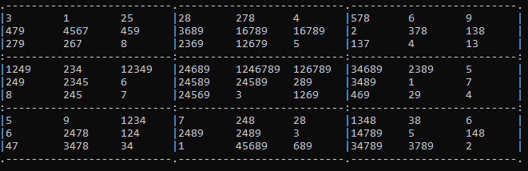
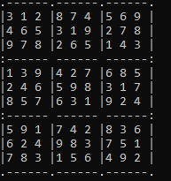

# Assignment 3-Or TOOLS

**:point_right:pip install ortools**

**:point_right:[string iteration](1/strgnread.py)**


**Το Σουντόκου είναι παζλ που βασίζεται στη λογική. Στόχος είναι να συμπληρωθούν όλα τα κουτάκια στον πίνακα (9x9), ώστε κάθε στήλη, κάθε σειρά και κάθε κουτάκι 3x3 να περιέχουν όλα τα ψηφία από το 1 μέχρι το 9. Μερικά κουτάκια είναι ήδη συμπληρωμένα, ώστε να υπάρχει μόνο μία δυνατή λύση.
Το σουντόκου επινοήθηκε από τον Αμερικανό Χάουαρντ Γκαρνς το 1979 και δημοσιεύτηκε για πρώτη φορά από την εταιρεία Dell Magazines με το όνομα "Number Place".Έγινε δημοφιλές στην Ιαπωνία το 1986, όταν εκδόθηκε από τον οίκο Nikoli και δόθηκε το όνομα Sudoku. Έγινε μόδα ανά την υφήλιο το 2005.**

---
## RESOURCES

* [ΕΚΦΩΝΗΣΗ](https://chgogos.github.io/dituoi_agp/resources/agp_assignment20210515.pdf)
* [Sudoku Explanation](https://www.sudoku.name/rules/el)


## ΕΡΩΤΗΜΑΤΑ ΕΡΓΑΣΙΑΣ
* Εμφάνιση preview για sudoku:[data input](1/readdata.py)

    ```
        def Formatter(sudokustart):
            data=list()
            #15 χαρακτήρες η κάθε γραμμή
            #13 γραμμές συνολικά
            counter=9
            previouscounter=0
            while counter<=81:
                data.append(sudokustart[previouscounter:counter])
                previouscounter=counter
                counter+=9
            totallinelength=len(data[0])+4
            print(str('.'+'-'*6+'')*3,end='')
            print('.')
            counter=0
            for x in data:
                if counter%3==0 and counter!=0:
                    print(':',end='')
                    print('------ '*2,end='')
                    print('------:')
                print('|',end='')
                for j in range(0,len(x),3):
                    print(str(x[j]) if x[j]!='0' else '.',str(x[j+1]) if x[j+1]!='0' else '.',str(x[j+2]) if x[j+2]!='0' else '.','|',end='')
                print()
                counter+=1
            print(str('.'+'-'*6+'')*3+'.')

    def main():
        sudokustart=''
        if len(sys.argv)!=2:
            with open(default,'r') as F:
                sudokustart=F.readline().strip()
        else:
            sudokustart=sys.argv[1]
        if len(sudokustart)!=81:
            with open(default,'r') as F:
                sudokustart=F.readline().strip()
        Formatter(sudokustart=sudokustart) 
    ```

    * Αποτέλεσμα
        
        

    <br><br>

* Pencil Mark:[pencil mark](Pencilmark.py)
    ```
        from readdatatemplate import StringRead
        from functools import reduce

        class square:
            def __init__(self):
                self.container=list()
                self.marks=dict()

            def AppendRow(self,row):
                self.container.append(row)

            def __str__(self):
                strng=''
                for x in self.container:
                    strng+=x+'\n'
                return strng

            def Marking(self,linestr,columnstr):
                pass

        class RCTuple:
            def __init__(self):
                self.textrow=''
                self.textcol=''

            def __str__(self):
                return f'RowText:{self.textrow}\nColumnText:{self.textcol}\n'

        class MarkingTuple:
            def __init__(self,r,c):
                self.row=r
                self.column=c
                self.numbers=list()

            def addMarker(self,num):
                self.numbers.append(num)

            def __str__(self):
                strng=f"Row:{self.row}\nColumn:{self.column}\n"
                for n in self.numbers:
                    strng+=f"Number:{n}\n"
                return strng


        # Functions for Data Spliting
        def MakeSquares(data):
            index=0
            counter=3
            squares=list()
            while index<7:
                asquare=None
                for l in range(len(data)):
                    if l%3==0:
                        if asquare!=None:
                            squares.append(asquare)
                        asquare=square()
                    asquare.AppendRow(''.join([data[l][x] for x in range(index,index+3)]))
                    if l==len(data)-1:
                        squares.append(asquare)

                index+=3
            return squares

        def MakeRowColumnMap(data):
            records=dict()
            for i in range(len(data)):
                for j in range(len(data[i])):
                    rec=RCTuple()
                    key=f'{i}-{j}'
                    rec.textrow=data[i]
                    rec.textcol=reduce(lambda y,x:y+x[j],data,'')
                    records.update({key:rec})
            return records

        def Marking(data):
            rclist=MakeRowColumnMap(data)
            squares=MakeSquares(data)
            squareid=dict()
            for i in range(len(squares)):
                squareid.update({i:squares[i]})
            squareindex=0
            columncount=3

            #Find Markings
            markings=list()
            availablenumbers=[chr(x) for x in range(48,58)]
            for i in range(len(data)):
                if i%3==0 and i!=0:
                    squareindex+=1
                tempid=squareindex
                for j in range(len(data[i])):
                    if j%3==0 and j!=0:
                        tempid+=3
                    key=f'{i}-{j}'
                    if data[i][j]=='0':
                        marker=MarkingTuple(i,j)
                        for l in availablenumbers:
                            if l not in str(squareid[tempid]) and l not in rclist[key].textrow and l not in rclist[key].textcol:    
                                marker.addMarker(l)
                        markings.append(marker)

            for marker in markings:
                print(str(marker))


        def main():
            data=StringRead()
            raw_data=''.join(data)
            print(raw_data)
            Marking(data)


        if __name__=='__main__':
            main()
    ```
* Pencil Mark-Εμφάνιση στην γραμμή εντολών:[Pencil Marking](PencilMark.py)
    ```
        from readdatatemplate import StringRead,Formatter
        from functools import reduce
        from pandas import DataFrame

        gap=13

        class square:
            def __init__(self):
                self.container=list()
                self.marks=dict()

            def AppendRow(self,row):
                self.container.append(row)

            def __str__(self):
                strng=''
                for x in self.container:
                    strng+=x+'\n'
                return strng

            def Marking(self,linestr,columnstr):
                pass

        class RCTuple:
            def __init__(self):
                self.textrow=''
                self.textcol=''

            def __str__(self):
                return f'RowText:{self.textrow}\nColumnText:{self.textcol}\n'

        class MarkingTuple:
            def __init__(self,r,c):
                self.row=r
                self.column=c
                self.numbers=list()

            def addMarker(self,num):
                self.numbers.append(num)

            def text(self):
                return ''.join(self.numbers)

            def __str__(self):
                strng=f"Row:{self.row}\nColumn:{self.column}\n"
                for n in self.numbers:
                    strng+=f"Number:{n}\n"
                return strng


        # Functions for Data Spliting
        def MakeSquares(data):
            index=0
            counter=3
            squares=list()
            while index<7:
                asquare=None
                for l in range(len(data)):
                    if l%3==0:
                        if asquare!=None:
                            squares.append(asquare)
                        asquare=square()
                    asquare.AppendRow(''.join([data[l][x] for x in range(index,index+3)]))
                    if l==len(data)-1:
                        squares.append(asquare)

                index+=3
            return squares

        def MakeRowColumnMap(data):
            records=dict()
            for i in range(len(data)):
                for j in range(len(data[i])):
                    rec=RCTuple()
                    key=f'{i}-{j}'
                    rec.textrow=data[i]
                    rec.textcol=reduce(lambda y,x:y+x[j],data,'')
                    records.update({key:rec})
            return records

        def Marking(data):
            rclist=MakeRowColumnMap(data)
            squares=MakeSquares(data)
            squareid=dict()
            for i in range(len(squares)):
                squareid.update({i:squares[i]})
            squareindex=0
            columncount=3

            #Find Markings
            markings=list()
            availablenumbers=[chr(x) for x in range(48,58)]
            for i in range(len(data)):
                if i%3==0 and i!=0:
                    squareindex+=1
                tempid=squareindex
                for j in range(len(data[i])):
                    if j%3==0 and j!=0:
                        tempid+=3
                    key=f'{i}-{j}'
                    if data[i][j]=='0':
                        marker=MarkingTuple(i,j)
                        for l in availablenumbers:
                            if l not in str(squareid[tempid]) and l not in rclist[key].textrow and l not in rclist[key].textcol:    
                                marker.addMarker(l)
                        markings.append(marker)
            searchmark=dict()
            for marker in markings:
                searchmark.update({f'{marker.row}-{marker.column}':marker})
            return searchmark

        def CmdMarking(data,searchmark):
            counter = 0
            #Start with printing results
            print(str('.'+'-'*(2*gap)+'')*3+'.')
            for x in data:
                if counter % 3 == 0 and counter != 0:
                    print(':', end='')
                    print(('-'*(2*gap)+':')*2, end='')
                    print('-'*(2*gap)+':')
                print('|', end='')
                for j in range(0, len(x), 3):
                    output1=str(x[j]+' '*7) if x[j] != '0' else searchmark[f'{counter}-{j}'].text()+str(' '*(8-len(searchmark[f'{counter}-{j}'].text())))
                    output2=str(x[j+1]+' '*7) if x[j+1] !='0' else searchmark[f'{counter}-{j+1}'].text()+str(' '*(8-len(searchmark[f'{counter}-{j+1}'].text())))
                    output3=str(x[j+2]+' '*7+'|') if x[j+2] != '0' else searchmark[f'{counter}-{j+2}'].text()+' '*(8-len(searchmark[f'{counter}-{j+2}'].text()))+'|'
                    print(output1,output2,output3,end='')
                print()
                counter += 1
            print(str('.'+'-'*(2*gap)+'')*3+'.')
    ```

    * ΑΠΟΤΕΛΕΣΜΑΤΑ
        1. ΑΠΟΤΕΛΕΣΜΑΤΑ ΣΕ TXT:[txt results](2/results.out)
        2. ΑΠΟΤΕΛΕΣΜΑΤΑ MARKING ΣΕ TXT:[txt results](2/resultsmarking.out) 
        3. ΠΙΝΑΚΑΣ ΑΠΟΤΕΛΕΣΜΑΤΩΝ
        
        

    <br><br>

* CpSat Sudoku Solution
    - [solver.py](solver.py)
    - [input txt file]()
    ```
        def SolveSudoku():
            #Η επίλυση θα γίνει με βάση τον πίνακα που κατασκευάστηκε στην συνάρτηση readData

            #Μήκος Πλέγματος περιοχής 3Χ3
            regsize=3
            data=StringRead()
            maxval=len(data)
            print('Input Data')
            for x in data:
                print(x)
            print()
            #ΔΗΜΙΟΥΡΓΙΑ ΜΟΝΤΕΛΟΥ
            model=cp_model.CpModel()
            x=dict()
            for i in range(0,maxval):
                for j in range(0,len(data[i])):
                    if int(data[i][j])!=0:
                        # Κελιά τα οποία έχουν ήδη συμπληρωθεί
                        x[i,j]=int(data[i][j])
                    else:
                        x[i,j]=model.NewIntVar(1,maxval,f'x[{i},{j}]')
            
            #Περιορισμοί

            #-Διαφορετικά ψηφία ανά γραμμή
            for i in range(maxval):
                model.AddAllDifferent([x[i,j] for j in range(maxval)])

            #-Διαφορετικά ψηφία ανα στήλη
            for j in range(maxval):
                model.AddAllDifferent([x[i,j] for i in range(maxval)])

            #-Διαφορετικά ψηφία ανα πλέγμα
            for rowid in range(0,maxval,regsize):
                for colid in range(0,maxval,regsize):
                    model.AddAllDifferent([x[i,j] for j in range(colid,(colid+regsize)) for i in range(rowid,(rowid+regsize))]) 
            
            #Επίλυση Προβλήματος
            solver=cp_model.CpSolver()
            status=solver.Solve(model)
            result=''
            if status==cp_model.OPTIMAL:
                for rowid in range(maxval):
                    for colid in range(maxval):
                        result+=str(solver.Value(x[rowid,colid]))
            print(result)
            output=ToBoard(result)
            print('Output Data')
            Formatter(output) 
            print('Lapsed Time:{} \'s'.format(solver.WallTime()))
    ```
    * ΑΠΟΤΕΛΕΣΜΑΤΑ
        1. ΑΠΟΤΕΛΕΣΜΑΤΑ ΣΕ TXT ΑΡΧΕΙΟ:[results txt](3/solveroutput.out)
        2. FORMATTED ΑΠΟΤΕΛΕΣΜΑΤΑ:[solver results](3/solveresults.out)

        
    
<br><br>   


## ORTOOLS Examples
* [OR_TOOLS](https://github.com/vasnastos/AGP/tree/master/OR_TOOLS)
* [LATIN SQUARE](3/latinSquaresCpSat.ipynb)
* [NQUEENS](https://github.com/vasnastos/AGP/blob/master/OR_TOOLS/nqueens.py)

