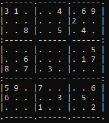

# Assignment 3-Or TOOLS

**:point_right:pip install ortools**


**Το Σουντόκου είναι παζλ που βασίζεται στη λογική. Στόχος είναι να συμπληρωθούν όλα τα κουτάκια στον πίνακα (9x9), ώστε κάθε στήλη, κάθε σειρά και κάθε κουτάκι 3x3 να περιέχουν όλα τα ψηφία από το 1 μέχρι το 9. Μερικά κουτάκια είναι ήδη συμπληρωμένα, ώστε να υπάρχει μόνο μία δυνατή λύση.
Το σουντόκου επινοήθηκε από τον Αμερικανό Χάουαρντ Γκαρνς το 1979 και δημοσιεύτηκε για πρώτη φορά από την εταιρεία Dell Magazines με το όνομα "Number Place".Έγινε δημοφιλές στην Ιαπωνία το 1986, όταν εκδόθηκε από τον οίκο Nikoli και δόθηκε το όνομα Sudoku. Έγινε μόδα ανά την υφήλιο το 2005.**

---
## RESOURCES

* [ΕΚΦΩΝΗΣΗ](https://chgogos.github.io/dituoi_agp/resources/agp_assignment20210515.pdf)
* [Sudoku Explanation](https://www.sudoku.name/rules/el)


## ΕΡΩΤΗΜΑΤΑ ΕΡΓΑΣΙΑΣ
* Read Data input:[data input](readdata.py)

```
    def Formatter(sudokustart):
        data=list()
        #15 χαρακτήρες η κάθε γραμμή
        #13 γραμμές συνολικά
        counter=9
        previouscounter=0
        while counter<=81:
            data.append(sudokustart[previouscounter:counter])
            previouscounter=counter
            counter+=9
        totallinelength=len(data[0])+4
        print(str('.'+'-'*6+'')*3,end='')
        print('.')
        counter=0
        for x in data:
            if counter%3==0 and counter!=0:
                print(':',end='')
                print('------ '*2,end='')
                print('------:')
            print('|',end='')
            for j in range(0,len(x),3):
                print(str(x[j]) if x[j]!='0' else '.',str(x[j+1]) if x[j+1]!='0' else '.',str(x[j+2]) if x[j+2]!='0' else '.','|',end='')
            print()
            counter+=1
        print(str('.'+'-'*6+'')*3+'.')

  def main():
      sudokustart=''
      if len(sys.argv)!=2:
          with open(default,'r') as F:
              sudokustart=F.readline().strip()
      else:
          sudokustart=sys.argv[1]
      if len(sudokustart)!=81:
          with open(default,'r') as F:
              sudokustart=F.readline().strip()
      Formatter(sudokustart=sudokustart) 
```

* Αποτέλεσμα



* Pencil Mark:[pencil mark]()

## ORTOOLS Examples
* [OR_TOOLS](https://github.com/vasnastos/AGP/tree/master/OR_TOOLS)
